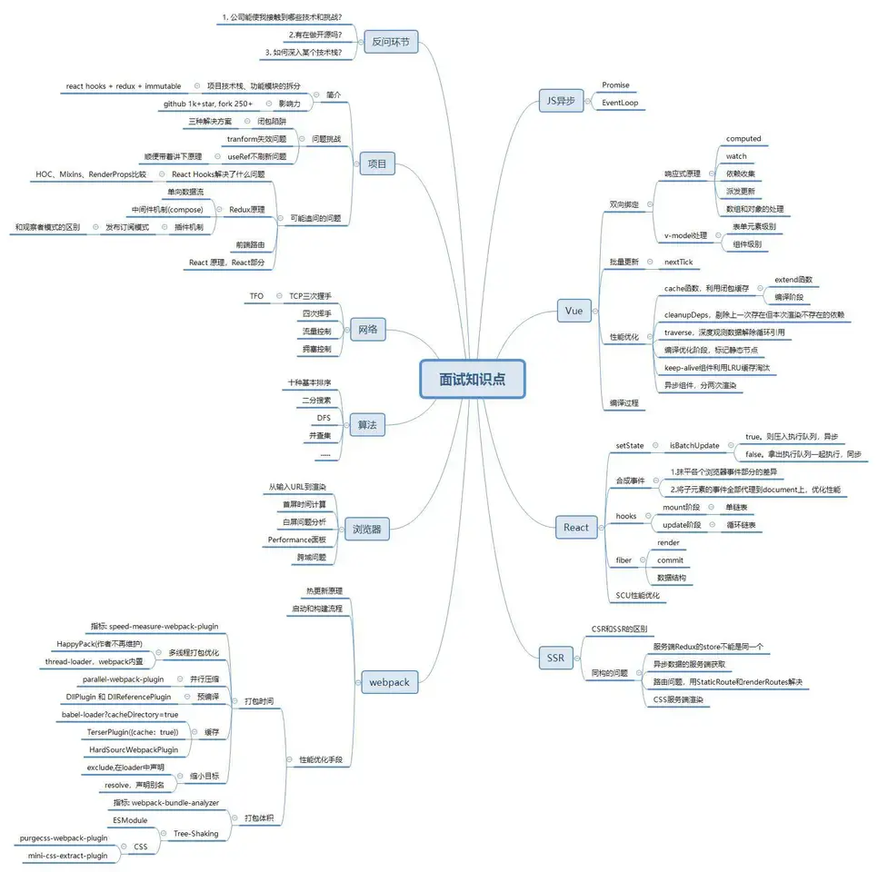

## css 
- [css预处理器 less、sass](/docs/frontEnd/css/less_sass)
- 如何实现换肤
- 样式封装

## javascript
- [数据类型](/docs/frontEnd/javascript/datatype)
- [原型 / 构造函数 / 实例 / this](/docs/frontEnd/javascript/prototype)
- [继承](/docs/frontEnd/javascript/extends)
- [ES6新增功能](/docs/frontEnd/javascript/es6)
- [event loop](/docs/frontEnd/javascript/eventLoop)
- lodash js 工具库
- [同源策略 跨域如何解决](/docs/frontEnd/network/http#跨域)
- [async await](/docs/frontEnd/javascript/asyncawait) 
- [promise](/docs/frontEnd/javascript/promise)
- [ES6](/docs/frontEnd/javascript/es6)
- [浏览器缓存](/docs/frontEnd/network/http#http-缓存)
- 设计模式

## 框架
- [vue2 和 vue3 的不同](/docs/frontEnd/vue3/vue2)
- vue 实现响应式的原理
- vue 渲染更新原理
- vue virtual DOM 的 diff 逻辑
- [vuex](/docs/frontEnd/vue/vuex)
- [vue-router](/docs/frontEnd/vue/vueRouter)

## 性能
- [从输入url到页面显示，发生了什么](/docs/frontEnd/network/http)
- [性能优化方案](/docs/frontEnd/network/performance)

## 工程化
- [webpack](/docs/tools/webpack)
  - 打包原理是什么
  - loader plugin
- 如何提升保存后更新的速度
- 如何提升打包速度
- vite [vite + vue3 ](https://juejin.cn/post/6926822933721513998)

## 小程序
- 授权登陆流程
- 微信系统打开小程序
- 渲染计算数据 .wxs 文件
- 页面跳转的几种 navigateTo redirectTo switchTab reLaunch 

## 算法
- [二叉树的各种遍历方式](https://juejin.cn/post/6844903998059708429)

## 掘金
- [字节](https://juejin.cn/post/6844904088337907720)
- [2021年前端面试](https://juejin.cn/post/6931530881924333575)
- [Webpack揭秘](https://juejin.cn/post/6844903685407916039)
- [Promise 中的三兄弟](https://segmentfault.com/a/1190000020034361)
- [JavaScript module](https://blog.csdn.net/jyb123/article/details/81207264)
- [script标签中的async和defer](https://www.cnblogs.com/jiasm/p/7683930.html)
- [vue3.0尝鲜，写一个win10日历](https://juejin.cn/post/6844904144667574286)
- [CSS Scoped](https://juejin.cn/post/6844903949900742670)
- [浏览器渲染过程与性能优化](https://juejin.cn/post/6844904040346681358)
- [webpack打包时生成个zip压缩包](https://juejin.cn/post/6972741467605303304)
- [聊一聊前端性能优化](https://juejin.cn/post/6911472693405548557)
- [vue递归组件的用法](https://blog.csdn.net/badmoonc/article/details/80380557)
