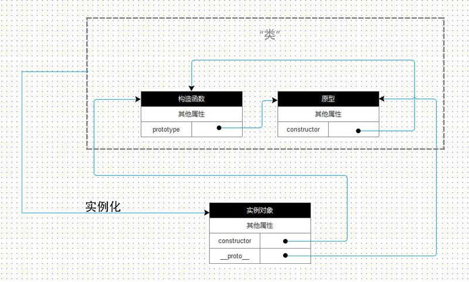
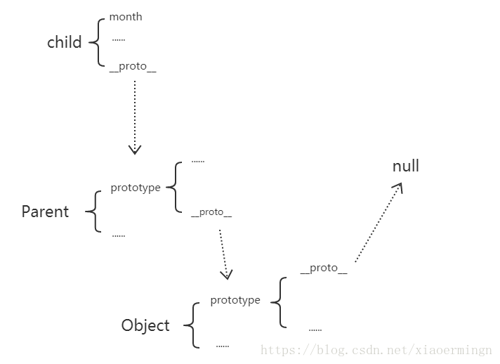

## 构造函数 constructor
1. 构造函数也是一个函数
2. 没有显示创建对象，直接将属性和方法赋值给 `this` ，没有 `return` 语句
3. 通过 new 关键字调用**构造函数**
4. 实例对象的 `constructor` 属性指向构造函数

## 创建实例对象
### new 关键字
1. 执行顺序
  - 创建一个对象 **var obj = {}**
  - 将对象的 __proto__ 指向构造函数的 prototype **obj.__proto__=Dog.prototype**
  - 将函数体内的this指向该对象，并将参数传递过去 call 或 apply
  - 执行构造函数体内的代码
  - 返回这个对象 
  
2. 手写一个 new 方法
  ```
  function Dog(name){
      this.name = name
  }
  Dog.prototype.sayName = function(){
      console.log(this.name)
  }
  // 上面是本身Dog
  function _new(fn,...args){   // ...args为ES6展开符,也可以使用arguments
    //先用Object创建一个空的对象,
    const obj = Object.create(fn.prototype)  //fn.prototype代表 用当前对象的原型去创建
    //现在obj就代表Dog了,但是参数和this指向没有修改
    const rel = fn.apply(obj,args)
    //正常规定,如何fn返回的是null或undefined(也就是不返回内容),我们返回的是obj,否则返回rel
    return rel instanceof Object ? rel : obj
  }
  var _newDog = _new(Dog,'这是用_new出来的小狗')
  _newDog.sayName()
  ```

### Object.create(Base)
1. 执行顺序
  - 创建一个空函数
  - 将函数的 `prototype` 指向参数 Base
  - 返回这个函数的实例对象

2. 手写实现方式
  ```
  Object.create =  function (Base) {
    var F = function () {};
    F.prototype = Base;
    return new F();
  };
  ```

### 创建一个空对象
1. Object.create(null) 创建一个干净的空对象， `No properties` 没有任何属性。
2. new Object() 等同于 Object.create(Object.prototype) ， `__proto__` 指向 Object.prototype
3. {} 等同于 new Object()

### new 和 Object.create 的区别
- new 只可以实例化构造函数
- Object.create 可以传入构造函数、对象、null
- new 的实例化对象的 `__proto__` 指向构造函数的原型；Object.create(constructor) 的实例化对象的 `__proto__` 指向构造函数本身。
- Object.create(constructor) 创建出来的实例对象，不可以访问构造函数本身的属性 `this.***` 
```
var Parent =  function(){
  this.name = "Zong"
}
var Parent2 = {
  name:"zong"
};
let child1 = new Parent();
let child2 = Object.create(Parent);
let child3 = Object.create(Parent2);
console.log(child1);//Parent {name: "Zong"}
console.log(child2);//Function {}
console.log(child3);//{},这里返回了一个对象但这个对象的__proto__.name为"Zong"

// chile2.proto => Parent => 
// Parent.proto => Function.prototype => 
// Function.prototype.proto => Object.prototype.proto => null
```

### instanceof 运算符
语法 `object instanceof constructor`。 用来判断一个对象原型链上是否存在某个构造函数的原型 `prototype`。

会一直沿着原型链查找，直到找到 `x.__proto__.__proto__...===y.prototype` 为止，即 x为y的实例。

手写一个 instanceof 方法
```
  // 主函数
  function newInstanceof(current, target) {
    // 获取左边的__proto__
      let left = current.__proto__
      
      // 获取右边的prototype
      let right = target.prototype
      
      // while循环查找左边的__proto__
      while(left) {
        if(left === right) {
            return true
          }
          
          left = left.__proto__
      }
      
      return false
  }

  // 测试  
  console.log(newInstanceof('123', String))
```

## 原型
- 所有 **函数**都有一个 `prototype` 。默认函数的原型包含两个属性 `constructor` 和 `__proto__`
- 所有 **对象**中都包含一个 `__proto__` (非标准)的属性指向父级的 `prototype` (该对象的原型)
- 所有引用类型的 `__proto__` 属性指向它构造函数的 `prototype`

```
var fun = function(){}
var newFun = new fun()

console.log(newFun.__proto__ === fun.prototype)

console.log( fun.prototype )

// true

// constructor: ƒ ()
// __proto__: Object

```

## 原型链
如果 Child 的原型对象的 prototype 指向 Parent 的实例对象 p ，此时如果实例化一个A的实例对象 c，那么 `c.__proto__` 指向 `Child.prototype` 指向 p， `p.__proto__` 指向 `Parent.prototype` 。这样就形成了一个实例与原型的链条。

当访问对象 c 的某个属性时，会先在 c 本身查找，如果没有则去查找 `c.__proto__` 即 `Child.prototype`；如果还没有，则继续在构造函数 Child 的 `prototype` 的 `__proto__` 上继续查找，即 `p.__proto__` / `Parent.prototype`，这样一层一层向上查找就会形成一个链式结构，我们称为**原型链**。 

沿着原型链查找，直到到null还没有找到，则返回undefined。`Object.prototype.__proto__ === null`



## this 指向
通常指向调用这个方法或函数的对象。
[this 指向问题](https://www.cnblogs.com/lisha-better/p/5684844.html)
[逐梦子](https://juejin.cn/post/6844903462984155143)

箭头函数的this 一旦创建，不可以修改。所以不可以作为构造函数

改变this指向的方式：new call/apply setTimeout/setInterval
- new 的 this 指向实例对象
- call/apply 的 this 指向第一个参数对象
- setTimeout/setInterval 中的 this 指向 window 对象；解决办法**使用箭头函数**

构造函数 return 实例 this 指向问题
- 如果 return 对象， this 指向 返回的对象
- 如果 return 非对象，this 指向函数的实例 （undefined null 也是非对象）
```
function fn()  
{  
  this.user = '追梦子';  
  return {};  
}
var a = new fn;  
console.log(a.user); //undefined

function fn()  
{  
  this.user = '追梦子';  
  return undefined;
}
var a = new fn;  
console.log(a.user); //追梦子
```
