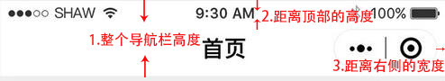

## 自定义Navigation

 Navigation是小程序的顶部导航组件，当页面配置navigationStyle设置为custom的时候可以使用此组件替代原生导航栏。

[参考连接](https://www.cnblogs.com/sese/p/9761713.html)

[微信文档](https://developers.weixin.qq.com/miniprogram/dev/extended/weui/navigation.html)

[获取状态栏的高度 statusBarHeight](https://developers.weixin.qq.com/miniprogram/dev/api/base/system/system-info/wx.getSystemInfo.html)

[获取菜单按钮布局信息](https://developers.weixin.qq.com/miniprogram/dev/api/ui/menu/wx.getMenuButtonBoundingClientRect.html)