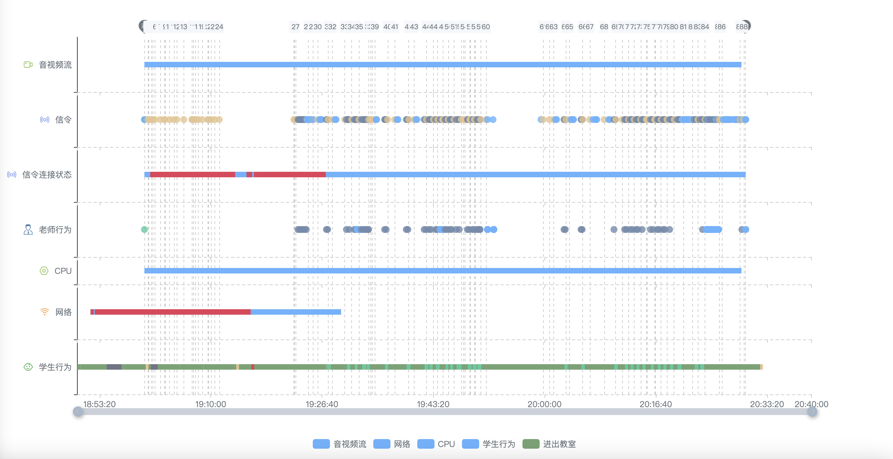

## echart 制作时序图

[echart v4 api文档](https://echarts.apache.org/v4/zh/option.html#visualMap)

## 制作一个时序图


## 如何实现时序图
### 绘制坐标系 

  绘制多个坐标系`grid`，横轴`xAxis`为时间轴，纵轴`yAxis`为类目分类轴

  - [`grid`](https://echarts.apache.org/v4/zh/option.html#grid)  ** 直角坐标系 ** 

  `grid.height` 设置坐标系的高度， `grid.top` 设置坐标系的位置

  - [`xAxis`](https://echarts.apache.org/v4/zh/option.html#xAxis)  ** 横坐标 ** 
  
  直角坐标系 grid 中的 x 轴，横坐标表示一个事件段，可以使用value或者time类型，我选择的是time类型，具体配置项参照下表：
  
  | 配置项 | 值 |  功能  |
  | ------ | ------------ | ------------------ |
  | `type` | 'value' | 适用于连续数据 |
  | `triggerEvent` | true | 坐标轴的标签是否响应和触发鼠标事件，默认不响应。用来实现点击横坐标轴上的时刻，放大坐标轴。 |
  | `silent` | false | 坐标轴是否是静态无法交互，默认为false。当设置true时，横坐标上的任何交互都会失效，包括click、hover等 |
  | `min` | `startTime` | 坐标轴刻度最小值。设置为开始时间 |
  | `max` | `endTime` | 坐标轴刻度最小值。设置为结束时间 |
  | `scale` | true | 是否是脱离 0 值比例。设置成 true 后坐标刻度不会强制包含零刻度。  |
  | `minInterval` | 1000 | 自动计算的坐标轴最小间隔大小。为了防止坐标轴无限放大，设置为1000表示最小间隔为1s |
  | `axisLabel.show` | true | 是否显示刻度标签。最下边一个分类展示x坐标轴，其他不展示。`axisLabel.show: index == (this.categories.length-1)` |
  | `axisLabel.color` | '#6c757d' | 设置刻度标签文字的颜色。 |
  | `axisLabel.formatter` | Function | 设置刻度标签的内容格式器。`(val, index) => { return ''; }` |
  | `axisPointer.show` | true | 展示坐标轴指示器。`tooltip.axisPointer.type` 设置为 'cross' 则默认显示标签，否则默认不显示 |
  | `axisPointer.label.show` | false | 指示器的文本标签，如果 tooltip.axisPointer.type 设置为 'cross' 则默认显示标签，否则默认不显示。
  | `splitLine.show` | true | 是否展示坐标轴中的分割线。默认数值轴显示，类目轴不显示。 |
  | `gridIndex` | `index` | x轴所在的 grid 的索引，默认位于第一个 grid。根据分类的索引设置gridIndex |

  - [`yAxis`](https://echarts.apache.org/v4/zh/option.html#yAxis) ** 纵坐标 ** 
  
  由于时序图y轴 `yAxis` 上的类目数量不固定，在使用yAxisIndex时候需要分情况计算,所以采用的是多个坐标系没个坐标系类目数量为1的方式。
  
  | 配置项 | 值 |  功能  |
  | ------ | ------------ | ------------------ |
  | `type` | 'category' | 类目轴，适用于离散的类目数据 |
  | `triggerEvent` | true | 和xAxis配置类似 |
  | `data` | Array | 类目数据，在类目轴（type: 'category'）中有效。如果不在这里设置则自动从`series.data`中获取 |
  
### 绘制图表 
  - [`series-custom`](https://echarts.apache.org/v4/zh/option.html#series-custom)

  自定义系列可以自定义系列中的图形元素渲染。从而能扩展出不同的图表。

  | 配置项 | 值 |  功能  |
  | ------ | ------------ | ------------------ |
  | `type` | 'custom' | 自定义图形元素渲染。用户绘制时序图中的长条装图形。 |
  | `legendHoverLink` | false | 是否启用**图例** hover 时的联动高亮。 |
  | `hoverAnimation` | true | 是否开启鼠标 hover 的提示动画效果。 |
  | `xAxisIndex` | 0 | 使用的 y 轴的 index，在单个图表实例中存在多个 y轴的时候有用。 |
  | `yAxisIndex` | 0 | 使用的 x 轴的 index，在单个图表实例中存在多个 x 轴的时候有用。 |
  | `name` | '学生行为' | 系列名称，用于tooltip的显示，legend 的图例筛选 |
  | `silent` | true | 与 `grid.silent` 相同 |
  | `encode` | Object | 可以定义 data 的哪个维度被编码成什么。{ x: [0,1], y: [2] } |
  | `label.show` | true | 是否显示图形上的文本标签。 |
  | `label.position` | 'insideLeft' | 设置标签的位置。inside、outside 和 top、bottom、left、right组合 |
  | `label.istance` | 5 | 距离图形元素的距离。 |
  | `label.formatter` | Function | 标签内容格式器。用来根据data中的数据经过逻辑处理展示在标签上。 |
  | `z` | 2 | 自定义图组件的所有图形的z值。控制图形的前后顺序。z值小的图形会被z值大的图形覆盖。 |
  | `data.itemStyle` | Object | 图形样式。 |
  | `data.itemStyle.color` | string | 图形的颜色 |
  | `data.itemStyle.opacity` | .8 | 图形透明度 |
  | `emphasis` | Object | 图形的高亮样式。 |
  | [`emphasis.label`](https://echarts.apache.org/v4/zh/option.html#series-line.emphasis.label) | Object | 图形的高亮的标签样式。 |
  | [`emphasis.itemStyle`](https://echarts.apache.org/v4/zh/option.html#series-line.emphasis.itemStyle) | Object | 图形的高亮的图形样式。 |
  | `emphasis.itemStyle.opacity` | .9 | 图形高亮时的图形透明度。 |
  | `emphasis.itemStyle.shadowBlur` | 4 | 图形阴影的模糊大小。 |
  | `emphasis.itemStyle.shadowOffsetX` | 0 | 阴影垂直方向上的偏移距离。 |
  | `emphasis.itemStyle.shadowOffsetY` | 2 | 阴影水平方向上的偏移距离。 |
  | `emphasis.itemStyle.shadowColor` | string | 阴影颜色。 |
  | [`renderItem`](https://echarts.apache.org/v4/zh/option.html#series-custom.renderItem) | Function | custom 系列需要开发者自己提供图形渲染的逻辑。 |
  | `renderItem.return` | Object | 返回图形元素。 |
  | `renderItem.return.type` | 'rect' | 长方形。 |
  | `renderItem.return.shape` | Object | 绘制图形位置大小。 |
  | `renderItem.return.style` | Object | 绘制图形基本样式。 |
  | `renderItem.return.styleEmphasis` | Object | 绘制图形高亮时样式。 |

  
  - [`series-scatter`](https://echarts.apache.org/v4/zh/option.html#series-scatter)

  散点（气泡）图。

  | 配置项 | 值 |  功能  |
  | ------ | ------------ | ------------------ |
  | `type` | 'scatter' | 散点图。 |
  | `symbol` | string | 单个数据标记的图形。可以用image或者echart的标记类型。 |
  | `symbolSize` | 10 | 标记的大小。 |
  | `data` | Array | 系列中的数据内容数组。数组项通常为具体的数据项。 |
  | `data.value` | number | 单个数据项的数值。 |
  | `data.symbol` | string | 单个数据标记的图形。 |
  | `data.symbolSize` | 10 | 单个数据标记的大小。。 |
  | `markPoint` |  |  |

### 绘制图表标线
  [`markLine`](https://echarts.apache.org/v4/zh/option.html#series-line.markLine)

  图表标线。

  | 配置项 | 值 |  功能  |
  | ------ | ------------ | ------------------ |
  | `symbol` | ['none', 'none'] | 标线两端的标记类型。格式和`data.symbol`相同 |
  | `lineStyle` | Object | 标线的样式。`{type: 'dashed', color: this.lineColor, width: 1}` |
  | `lineStyle` | Object | 标线的样式 |

### 美化时序图
- 绘制图例 
  [`legend`](https://echarts.apache.org/v4/zh/option.html#legend)
- 绘制提示
  [`tooltip`](https://echarts.apache.org/v4/zh/option.html#tooltip)
- 增加缩放功能
  [`dataZoom`](https://echarts.apache.org/v4/zh/option.html#dataZoom)

- 坐标轴增加图标
  [`yAxis.axisLabel.rich`](https://echarts.apache.org/v4/zh/option.html#xAxis.axisLabel.rich)
  ```
  axisLabel: {
    formatter: function (value) {
      return '{BG| }  {value|' + value + '}';
    },
    rich: {
      value:{
        color: '#6c757d'
      },
      BG: {
        height: 15,
        align:'center',
        backgroundColor:{
          image: symbolMap[categoryName].icon || ''
        }
      }
    }
  }
  ```
  `markLine` 给 label 增加图标和 `yAxis.axisLabel` 类似。在 `markLine.label.rich` 中设置


## 细化时序图功能

### 事件监听
  [`on`](https://echarts.apache.org/v4/zh/api.html#echartsInstance.on)
  ```
  this.sequenceChart.on('datazoom', (params) => {
    
  });
  ```
  ```
  this.sequenceChart.on('click', (params) => {
    // params.componentType 点击的组件类型 markLine、xAxis、yAxis等
    // params.data 点击的数据
    // params.value 点击的数值
  });
  ```
### 触发图例行为
  [`dispatchAction`](https://echarts.apache.org/v4/zh/api.html#echartsInstance.dispatchAction)
  ```
  // 触发缩放事件
  this.eChart.dispatchAction({
    type: 'dataZoom',
    startValue: startTime,
    endValue: endTime
  });
  ```