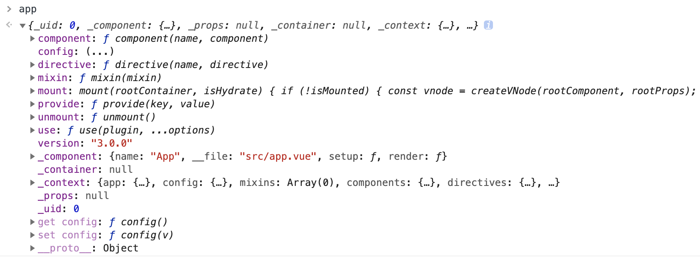

## 创建应用实例 

```
  const app = Vue.createApp({}).mount('#app')
```


vue 应用通过 `createApp` 函数创建一个新的应用实例，出自 `@vue/runtime-dom/dist/runtime-dom.cjs.prod.js`。返回一个带有 `mount` 方法的实例对象。**核心包括两个部分，`createRenderer` 和 `mount`**。

[vue3 源码解读(一)-createApp](https://juejin.cn/post/6881910894473773069)
[vue3 源码解析update和diff](https://zhuanlan.zhihu.com/p/372671989)

### createApp 源码解读

```
  // @file @vue/runtime-dom/dist/runtime-dom.cjs.prod.js
  const createApp = ((...args) => {
    const app = ensureRenderer().createApp(...args);
    {
        injectNativeTagCheck(app);
    }
    const { mount } = app;
    app.mount = (containerOrSelector) => {
        const container = normalizeContainer(containerOrSelector);
        if (!container)
            return;
        const component = app._component;
        if (!shared.isFunction(component) && !component.render && !component.template) {
            component.template = container.innerHTML;
        }
        // clear content before mounting
        container.innerHTML = '';
        const proxy = mount(container);
        container.removeAttribute('v-cloak');
        container.setAttribute('data-v-app', '');
        return proxy;
    };
    return app;
  });
```
  - ensureRenderer 单例模式的函数， `runtimeCore.createRenderer` 创建一个 `renderer`， `createApp()` 返回一个app实例。
  - 获取并保存app实例的 `mount` 方法
  - 重写实例的mount方法
    - `normalizeContainer` 获取根元素容器
    - 判断 `component.template` 是否为空，为空设置成根元素容器的innerHTML，并清空根元素容器的innerHTML
    - 调用保存的 `mount` 方法
    - 为根元素删除 `v-cloak` 属性，增加 `data-v-app` 属性
    - 返回mount方法返回的代理 `proxy`


### createRenderer 源码解析

```
  // @file @vue/runtime-core/dist/runtime-core.cjs.js
  function createRenderer(options) {
    return baseCreateRenderer(options);
  }

  function baseCreateRenderer(options, createHydrationFns) {
    const patch = ……
    const render = (vnode, container) => {
      if (vnode == null) {
        if (container._vnode) {
          unmount(container._vnode, null, null, true);
        }
      }
      else {
        patch(container._vnode || null, vnode, container);
      }
      flushPostFlushCbs();
      container._vnode = vnode;
    };
    return {
      render,
      hydrate,
      createApp: createAppAPI(render, hydrate)
    };
  }

  function createAppAPI(render, hydrate) {
    return function createApp(rootComponent, rootProps = null) {
      if (rootProps != null && !shared.isObject(rootProps)) {
        warn(`root props passed to app.mount() must be an object.`);
        rootProps = null;
      }
      const context = createAppContext();        
      const installedPlugins = new Set();
      let isMounted = false;
      const app = (context.app = {
        get config() { },
        set config(v) { },
        use() {},
        mixin() {},
        component() {},
        directive() {},
        mount() {},
        unmount() {},
        provide() {}
      });
      return app;
    };
  }

  function createAppContext() {
    return {
      app: null,
      config: {
        isNativeTag: shared.NO,
        performance: false,
        globalProperties: {},
        optionMergeStrategies: {},
        isCustomElement: shared.NO,
        errorHandler: undefined,
        warnHandler: undefined
      },
      mixins: [],
      components: {},
      directives: {},
      provides: Object.create(null)
    };
  }
```
  - `createAppAPI` 返回 `createApp` 函数
  - 调用 `createAppContext` 函数创建 `context` 对象
  - `installedPlugins` 存储通过 `use` 安装过的插件
  - `isMounted` 设置为false，在调用 `mount` 方法之后置为true
  - 创建 `app` 对象，挂在config、use、mixin、mount 等属性和函数。 **mount方法供runtime-dom.js文件中createApp方法内调用**
  - 返回 `app` 对象



### mount 方法解析

```
  mount(rootContainer, isHydrate) {
    if (!isMounted) {
      const vnode = createVNode(rootComponent, rootProps);
      // store app context on the root VNode.
      // this will be set on the root instance on initial mount.
      vnode.appContext = context;
      // HMR root reload
      {
        context.reload = () => {
          render(cloneVNode(vnode), rootContainer);
        };
      }
      if (isHydrate && hydrate) {
        hydrate(vnode, rootContainer);
      }
      else {
        render(vnode, rootContainer);
      }
      isMounted = true;
      app._container = rootContainer;
      rootContainer.__vue_app__ = app;
      {
        devtoolsInitApp(app, version);
      }
      return vnode.component.proxy;
    }
    else {
      warn(`App has already been mounted.\n` +
        `If you want to remount the same app, move your app creation logic ` +
        `into a factory function and create fresh app instances for each ` +
        `mount - e.g. \`const createMyApp = () => createApp(App)\``);
    }
  },
```

  - 调用 `createVNode` 创建 `vnode`
  - 调用 `baseCreateRenderer` 方法中创建的 `render` 方法
  - `render` 方法中调用 `patch` 方法，进行dom diff，渲染页面