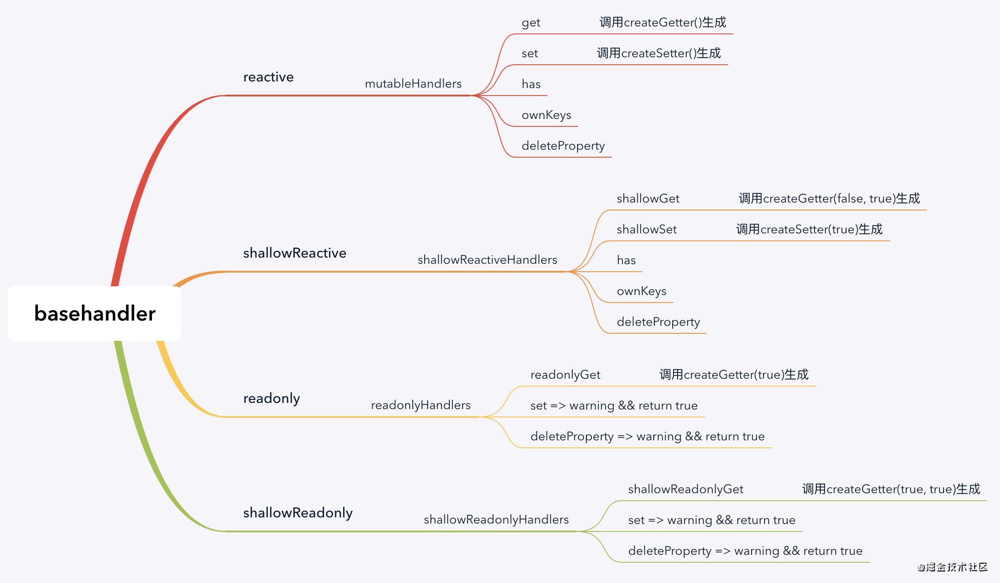
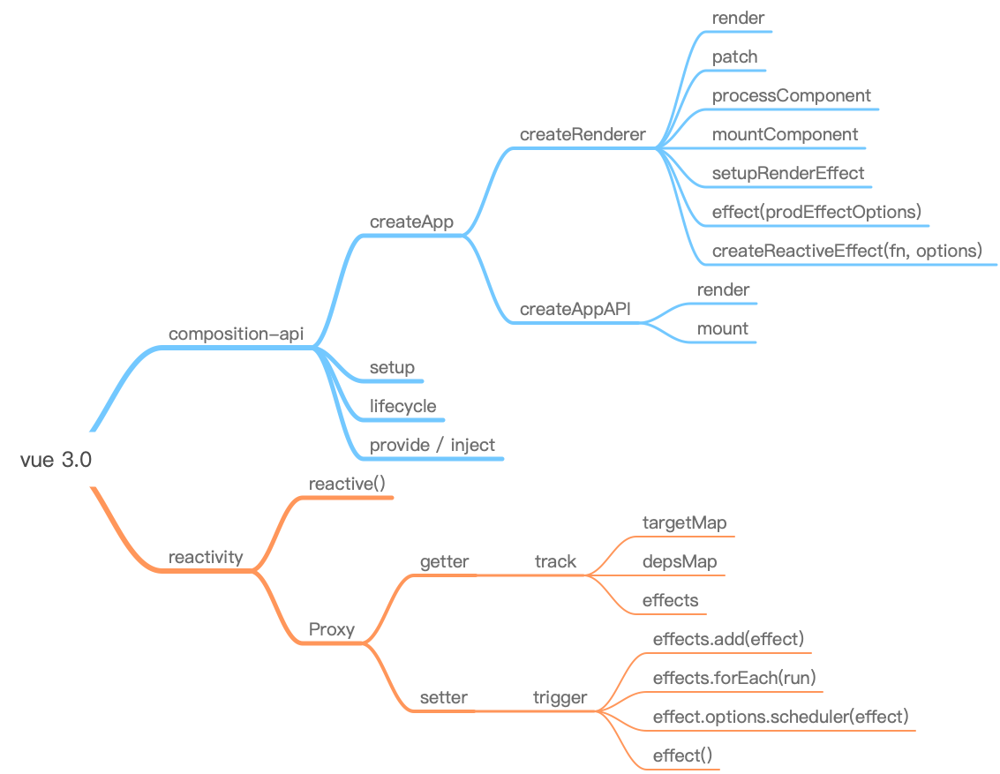

## 响应式相关知识点

### Proxy

  Proxy 对象用来定义基本操作的自定义行为handler（ get set deleteProperty has ownKeys 等 ）

  ```
    let proxyObj = new Proxy(target, handler);

    let p = {a: 1};
    let proxyObj = new Proxy(p, {
      get(target, propKey, receiver) {
        // receiver（可选）：proxy 实例本身（严格地说，是操作行为所针对的对象）
      },
      set(target, propKey, value, receiver) { }
    })
  ```

  - target： 通过 Proxy 代理的目标对象，可以是任何类型的对象，Array Function Object proxyObj等
  - handler： 一个对象，其属性是当执行一个操作时定义的代理行为函数。
  - proxyObj： 是被 Proxy 代理之后生成的新对象-代理对象，拥有 target 对象的所有属性和方法，行为和结果是在handler中自定义的。


### Reflect

  Reflect 是一个内置对象，可以获取目标对象的方法，这些方法和 Proxy 的 handler 一一对应。Reflect.fn 表示 Proxy 中 handler.fn 的默认行为

### WeakMap
### WeakSet

  

## 实现响应式的方式


  ### Object.defineProperty

  ```
  function defineReactive(data, key, val) {
    Object.defineProperty(data, key, {
      enumerable: true,
      configurable: true,
      get() {
        console.log(`get key: ${key} val: ${val}`)
        return val
      },
      set(newVal) {
        console.log(`set key: ${key} val: ${newVal}`)
        val = newVal
      }
    })
  }
  function observe(data) {
    Object.keys(data).forEach((key)=> {
      defineReactive(data, key, data[key])
    })
  }
  let test = [1, 2, 3]
  observe(test)
  console.log(test[1])   // get key: 1 val: 2
  test[1] = 2       // set key: 1 val: 2
  test.length = 1   // 操作是完成的,但是没有触发set
  console.log(test.length) // 输出1，但是也没有触发get
  ```

  ### Proxy

  ```
  let data = [1,2,3]
  let p = new Proxy(data, {
    get(target, key, receiver) {
      // target 目标对象，这里即data
      console.log('get value:', key)
      return target[key]
    },
    set(target, key, value, receiver) {
      // receiver 最初被调用的对象。通常是proxy本身，但handler的set方法也有可能在原型链上或以其他方式被间接地调用（因此不一定是proxy本身）。
      // 比如，假设有一段代码执行 obj.name = "jen"，obj不是一个proxy且自身不含name属性，但它的原型链上有一个proxy，那么那个proxy的set拦截函数会被调用，此时obj会作为receiver参数传进来。
      console.log('set value:', key, value)
      target[key] = value
      return true // 在严格模式下，若set方法返回false，则会抛出一个 TypeError 异常。
    }
  })
  p.length = 4   // set value: length 4
  console.log(data)   // [1, 2, 3, empty]
  ```

  ### 优缺点
  - Proxy 的优势
    - Proxy 监听整个对象而非属性，并生成一个代理对象。Object.defineProperty 只能劫持对象的属性,因此我们需要对每个对象的每个属性进行遍历；proxy 优化了数据劫持的性能。
    - Proxy 支持监听数组的变化，Object.defineProperty 只能对数组的7个方法进行监听（push pop shift unshift splice sort reverse）
    - Proxy 支持对象的新增和删除，数组长度的改变等操作。Object.defineProperty 需要通过 Vue.$set() 和 Vue.delete() 实现。
    - Proxy 支持对 set Map WeakMap WeakSet 进行监听。Object.defineProperty 不能对 `ES6` 新产生的数据结构进行监听。
  
  - Proxy 的劣势
    - Proxy 作为新标准存在兼容性问题。


  ### Reflect
  Reflect 是一个内置的对象，它提供拦截 JavaScript 操作的方法。Reflect 不是一个函数对象，因此它是不可构造的。


  ## reactive 源码解析

  ### reactive
  
  ### createReactiveObject

  [reactive 使用](https://juejin.cn/post/6893045604592418830#heading-5)

  ### mutableHandlers

  

  ## vue3 响应式系统

  [Vue3 的响应式系统](https://juejin.cn/post/6844903959660855309)  track 跟踪器  targetMap 收集依赖  trigger 触发更新

  

