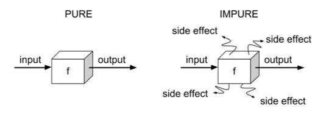

## watch
和 vue2 中的 watch 作用相同

```
  watch(watchObject, (newValue, oldValue) => {
    console.log(`watchObject changed: ${oldValue} -> ${newValue}`)
  })
```

## watchEffect
vue3 新增的 API

```
  watchEffect(() => console.log('watchEffect'))
```
### stop watchEffect
watchEffect 会返回一个用来停止监听的函数。
```
  const stop = watchEffect(() => {
    /* ... */
    doSomthing()
  })

  // later stop watchEffect
  stop()
```

### 取消 side effect (副作用)


watchEffect 的第一个参数 onInvalidate(fn) 传入的回调会在 watchEffect 重新运行或者 watchEffect 停止的时候执行。执行顺序是在doSomthing之前。
应用场景： 当 watchEffect 中引入的响应式变量频繁变化时，而 doSomthing 是一个异步请求，不能够确定那一次请求最后返回，可以通过 onInvalidate 来取消之前的请求。

```
  watchEffect((onInvalidate) => {
    onInvalidate(() => {
      apiCall.cancel()
    });
    
    const apiCall = someAsyncMethod(watchObject)
  })
```


## watch 和 watchEffect 的不同
- watchEffect 不需要指定监听的属性，会自动收集依赖，回调中引用过的响应式变量发生改变时，都会触发回调的执行。
  watch 只有监听的指定属性发生变化时才会触发回调的执行。
- watchEffect 取不到新旧值，watch 是可以拿到更新前后的值。
- 组件初始化时会执行一次 watchEffect 用来收集依赖，和 computed 同理。
- watchEffect 可以通过 onInvalidate 来消除 side effect， watch 无法消除。


