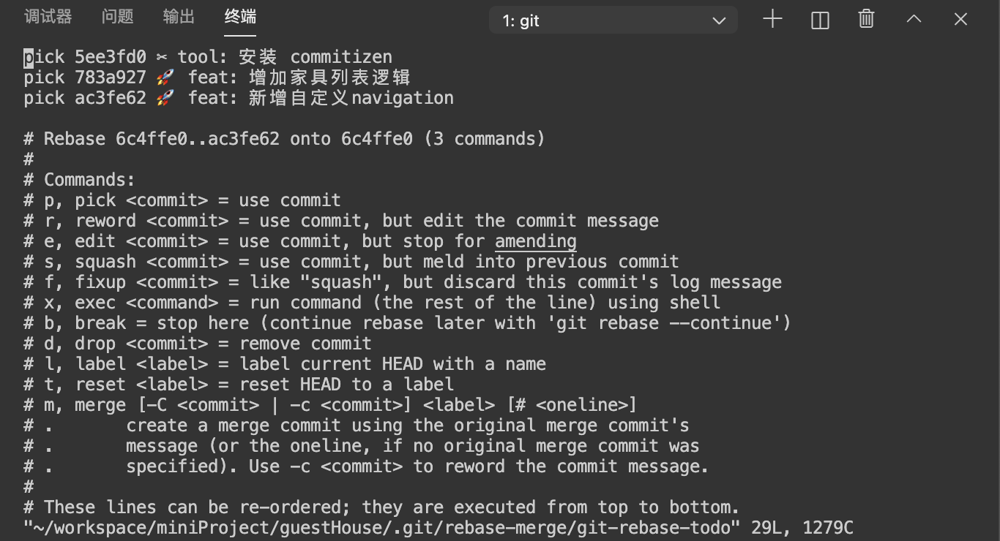
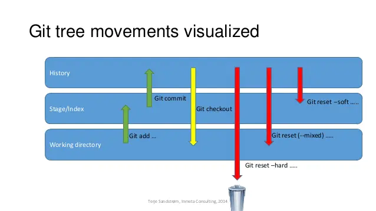

## git 基本命令
### git config
```
git config --global user.name userName
git config --global user.email email
```
配置级别
- --local (默认) 只影响本仓库
- --global 影响所有当前用户的git仓库
- --system 影响到全系统的git仓库

### git init
git init 用来初始化git仓库，会生成一个 .git 文件夹(HEAD、branches、config、description、hooks、info、objects、refs)

### git status
对状态的跟踪。
- 内容状态
  - 工作目录
  - 暂存区
  - 提交区
- 文件状态
  - 未跟踪
  - 已跟踪

```
  // 克隆远程代码
  git clone [远程仓库地址]

  // 创建一个新的本地分支
  git checkout -b local_branch

  // 撤销本次commit, push之前
  git reset
```

## git fetch 和 pull
git fetch 是将代码从远程拉到本地的提交区，可以再使用git merge 将提交区和工作区代码合并。

git pull 是将远程主机的最新代码拉到工作区并完成合并。相当于 git fetch + git merge

## git 本地项目关联远程分支
```
  // 初始化本地仓库
  git init 

  // 将工作区的修改添加到暂存区
  git add .

  // 提交暂存区的内容到本地仓库
  git commit -m '本地修改的注释内容'

  // 关联远程仓库
  git remote add origin [远程仓库地址]

  // 关联到远程分支；
  // origin/remote_branch是你本地分支对应的远程分支；your_branch是你当前的本地分支。
  // git branch --set-upstream-to=origin/remote_branch your_branch

  git pull 
  git push
```


## git 远程分支重命名
```
  // 拉取远程分支
  git pull

  // 将本地分支切换到想要重命名的分支
  git checkout oldBranchName

  // 本地分支重命名
  git branch -m newName 

  // 将重命名后的分支提交到远程
  git push origin newName

  // 删除远程的旧分支
  git push --delete origin oldName
```

## git 修改commit的内容
```
  // commit 操作之后， push 操作之前

  git commit --amend

  // 进入vim编辑器，点击键盘 i 进入编辑模式，编辑完毕后，点击键盘esc退回到普通模式，输入:wq 保存并退出
```

## git rebase用法

  [[git] rebase 用法小结](https://www.jianshu.com/p/4a8f4af4e803)

  ### 合并多个commit为一个commit
  ```
    // [startCommit] [endCommit] 为一个左开右闭区间
    git rebase -i [startCommit] [endCommit]

    // 输入 i 进入编辑模式

    // 修改指令类型后， esc 退出编辑模式，输入 :wq 保存并退出
  ```

  

  - pick：保留该commit（缩写:p）
  - reword：保留该commit，但我需要修改该commit的注释（缩写:r）
  - edit：保留该commit, 但我要停下来修改该提交(不仅仅修改注释)（缩写:e）
  - squash：将该commit和前一个commit合并（缩写:s）
  - fixup：将该commit和前一个commit合并，但我不要保留该提交的注释信息（缩写:f）
  - exec：执行shell命令（缩写:x）
  - drop：我要丢弃该commit（缩写:d）


  ### 恢复push -f 丢失的commit
  ```
    // 查看所有分支操作记录
    git reflog

    // 强制退回到某个commit, 第一列为记录id
    git reset --hard [记录id]

    // 强制推送到远程分支
    git push -f origin branch

  ```

## git reset用法

[Git Reset 三种模式](https://www.jianshu.com/p/c2ec5f06cf1a)
git的三个区域：
- Working Tree 当前的工作区域
- Index/Stage 暂存区域，和git stash命令暂存的地方不一样。使用git add xx，就可以将xx添加近Stage里面
- Repository 提交的历史，即使用git commit提交后的结果

### --hard
- **特点**
  - 重置HEAD的位置的同时，直接将工作区、暂存区、提交区都重置成 reset 目标节点的内容；效果相当于清空了工作区和暂存区。
- 应用场景
  - 放弃本地的所有更改
  - 确定撤销reset目标节点之后的所有commit

### --soft
- 特点
  - 重置HEAD的位置同时，保留工作区和暂存区的内容，让提交区的内容和reset目标节点一致；
  - 工作区和暂存区原来的内容都不变，原节点和reset目标节点之间的差异集会放入暂存区；
- 应用场景
  - 如果工作区和暂存取无记录，可以用于合并当前节点和reset目标节点之间意义不大的提交记录；
  - 工作区和暂存区没有修改，可以在执行 git reset --soft 后再次执行 git commit

### --mixed
- 特点
  - 重置HEAD的位置同时，只保留工作区内容，暂存取和提交区的内容与reset目标节点一致；
  - 原节点和reset目标节点之间的差异集会放在工作区
- 应用场景
  - 和 --soft 的区别是需要多一步 git add
  - 撤销错误的add/commit，